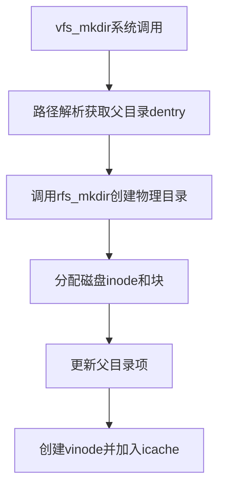

以下是对`rfs_mkdir`函数的详细功能解析，结合Linux文件系统实现原理和代码逻辑：

---
### 一、核心功能与流程
#### 1. **磁盘inode分配与初始化**（对应代码段1-22行）
- **空闲inode扫描**：遍历文件系统所有可能的inode块（`RFS_MAX_INODE_BLKNUM`），通过`rfs_read_dinode`读取每个inode，检查其类型是否为`R_FREE`。此逻辑类似Linux ext4的`ext4_new_inode`函数，通过位图查找空闲inode。
- **inode状态初始化**：找到空闲inode后，设置：
  - `size=0`：新目录初始大小为0
  - `type=R_DIR`：标记为目录类型（类似Linux的`S_IFDIR`标志）
  - `nlinks=1`：初始链接计数（父目录通过`..`递增该值）
  - `blocks=1`：分配首个数据块（通过`rfs_alloc_block`实现，类似ext4的块分配器）

#### 2. **父目录项添加**（对应代码段24-30行）
- 调用`rfs_add_direntry`函数，向父目录的目录块中写入新条目：
  - **目录项结构**：包含子目录名称`sub_dentry->name`和分配的inode编号`free_inum`，类似Linux的`struct ext4_dir_entry_2`
  - **原子性风险**：未实现日志机制，若写盘过程中断可能导致目录不一致

#### 3. **虚拟inode（vinode）管理**（对应代码段32-35行）
- **vinode分配**：`rfs_alloc_vinode`创建内存inode对象，关联磁盘inode编号`free_inum`
- **元数据同步**：`rfs_update_vinode`将内存状态同步到磁盘（类似Linux的`mark_inode_dirty`和`write_inode`）

---
### 二、关键数据结构关联
| 代码对象          | Linux对应结构      | 功能描述                                                                 |
|--------------------|--------------------|-------------------------------------------------------------------------|
| `struct vinode`    | `struct inode` | 内存中文件元数据（含磁盘inode编号、大小、块地址等）                       |
| `struct rfs_dinode`| `struct ext4_inode`| 磁盘inode结构，持久化存储文件类型、块指针等关键信息                   |
| `struct dentry`    | `struct dentry`| 目录项缓存，维护名称到inode的映射，支持路径解析                            |

---
### 三、潜在问题与改进建议
1. **并发安全性**  
   - 未对父目录inode加锁，多线程操作可能导致目录项覆盖（参考Linux的`inode->i_mutex`锁机制）
   - 改进方案：添加类似`spin_lock(&parent->i_lock)`的锁保护inode状态

2. **空间分配不足处理**  
   - 当`rfs_alloc_block`返回失败时未回滚已分配的inode（需补充`rfs_free_inode`逻辑）
   - 参考ext4的`ext4_should_retry_alloc`重试机制

3. **日志缺失**  
   - 直接写盘操作无崩溃一致性保护（可引入类似ext4的日志系统，先写入日志描述块）

---
### 四、与VFS层协作流程

此流程实现了VFS接口与具体文件系统的解耦，通过`struct vinode`抽象不同文件系统的inode操作。

---
### 五、扩展应用场景
- **嵌套目录创建**：需递归调用`rfs_mkdir`（当前实现仅支持单级）
- **硬链接支持**：通过递增`nlinks`实现（需修改`rfs_add_direntry`校验重复项）
- **ACL权限扩展**：在`struct rfs_dinode`中添加扩展属性字段（参考ext4的`i_inline_acl`）

该实现体现了类Unix文件系统目录创建的核心逻辑，但需进一步完善错误恢复和并发控制机制以满足生产环境要求。