# 实验2的源代码变化

## 概述
在实验2中我们开始使用虚拟内存，引入了页表和虚实地址的转换。

## `config.h`
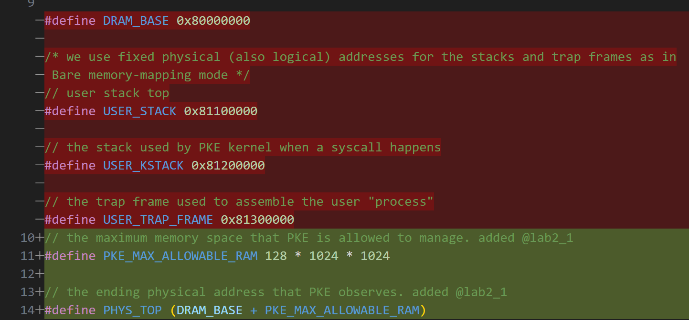

#### **1. 旧代码（被删除部分 - 红色）**
- 旧代码直接使用了固定的物理地址（**同时作为逻辑地址**）来分配 **用户栈（USER_STACK）**、**内核栈（USER_KSTACK）** 以及 **用户陷阱帧（USER_TRAP_FRAME）**。
- 这些地址位于 **0x81100000 ~ 0x81300000** 范围，说明在 **Bare memory-mapping 模式**（无虚拟地址映射）下，所有的地址访问都是直接基于物理地址的。
- 这意味着：
  - 用户栈 (`USER_STACK`) 在 `0x81100000`
  - 内核栈 (`USER_KSTACK`) 在 `0x81200000`
  - 用户陷阱帧 (`USER_TRAP_FRAME`) 在 `0x81300000`
  - 这是一种简单直接的内存管理方式，适用于 **没有虚拟内存的情况**。

---

#### **2. 新代码（添加部分 - 绿色）**
- 这次修改引入了 **PKE_MAX_ALLOWABLE_RAM** 和 **PHYS_TOP** 两个新的宏：
  ```c
  #define PKE_MAX_ALLOWABLE_RAM 128 * 1024 * 1024
  #define PHYS_TOP (DRAM_BASE + PKE_MAX_ALLOWABLE_RAM)
  ```
- **`PKE_MAX_ALLOWABLE_RAM`**:
  - 定义 PKE 内核可管理的 **最大物理内存大小**，这里设置为 **128MB**（`128 * 1024 * 1024`）。
  - 说明 **PKE 现在不再使用固定地址，而是引入了一个最大可管理的物理内存范围**。

- **`PHYS_TOP`**:
  - 计算 PKE 内核能够看到的 **物理地址空间的上限**。
  - 通过 `DRAM_BASE + PKE_MAX_ALLOWABLE_RAM` 确定最高地址。
  - `DRAM_BASE` 仍然是 `0x80000000`，所以 `PHYS_TOP` 计算得 `0x80000000 + 128MB = 0x88000000`。

---

#### **3. 变化的意义**
- **旧代码**：基于物理地址直接映射，适用于 **裸机模式（Bare Metal）**。
- **新代码**：
  1. **取消了固定物理地址分配**，转而使用 **动态管理的物理内存范围**（`PKE_MAX_ALLOWABLE_RAM`）。
  2. **引入 `PHYS_TOP`** 作为 **PKE 内核的物理内存上限**，而不是让代码直接引用硬编码的固定地址。
  3. 这意味着 **后续可能会加入动态内存管理机制**，比如：
     - **虚拟内存映射（Paging）**
     - **动态分配内核栈、用户栈、陷阱帧**
     - **支持多个进程的内存管理**
  
**总结**：
- **旧方案**：直接使用固定的物理地址，无虚拟内存。
- **新方案**：引入最大物理内存限制 (`PKE_MAX_ALLOWABLE_RAM`)，**为未来的虚拟内存管理做准备**。


## `elf.c`
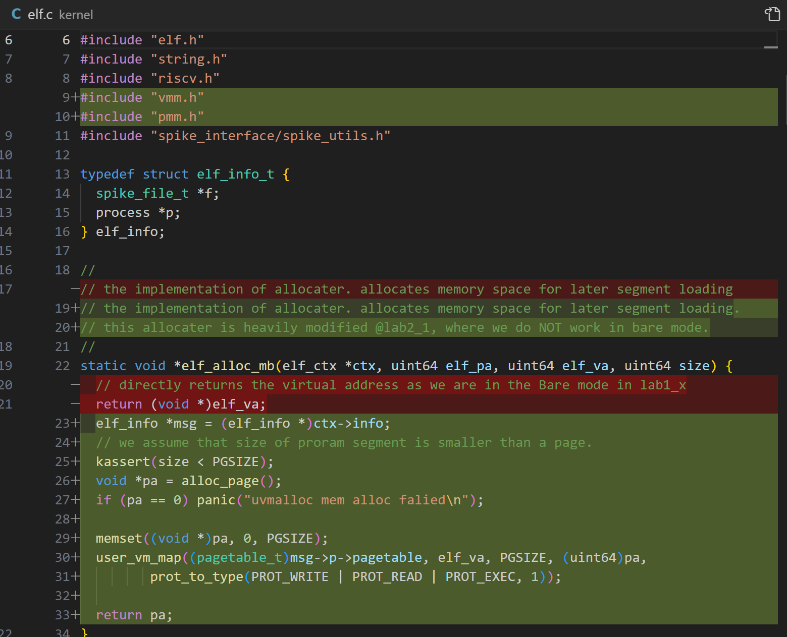
### **ELF 解析中的内存分配机制更新**

#### **1. 代码变更概述**
这次提交的修改主要影响 **ELF 加载器**（`elf.c`），重点在 **内存分配逻辑的演变**，从 **直接返回虚拟地址** 到 **引入物理页分配及虚拟内存映射**。

#### **2. 具体变更分析**
 **(1) 头文件更新**
**新增了：**
```c
#include "vmm.h"
#include "pmm.h"
```
- **`vmm.h`**（虚拟内存管理）：提供页表映射功能。
- **`pmm.h`**（物理内存管理）：提供物理页的分配功能。
- 这些新引入的头文件表明 **ELF 加载器现在依赖于分页机制，而不是直接使用裸机物理地址**。

 **(2) 旧代码（被删除部分 - 红色）**
```c
// directly returns the virtual address as we are in the Bare mode in lab1_x
return (void *)elf_va;
```
- **之前的实现**：在 **lab1_x** 阶段，ELF 加载时直接使用 `elf_va` 作为物理地址，**完全不涉及物理页分配和页表映射**。
- **问题**：这在 **裸机（Bare Mode）** 下是合理的，因为物理地址和虚拟地址是相同的。但随着 **分页机制的引入**，这种方式已经不可行。

 **(3) 新代码（新增部分 - 绿色）**
```c
void *pa = alloc_page();
if (pa == 0) panic("uvmalloc mem alloc falied\n");
```
- **调用 `alloc_page()` 分配物理页**：
  - 现在 ELF 加载器 **不再直接使用虚拟地址，而是先分配一个物理页**。
  - `alloc_page()` 负责从 **物理内存管理器** 申请一页物理内存。
  - 如果分配失败，则触发 `panic` 终止执行。

```c
memset((void *)pa, 0, PGSIZE);
```
- **初始化分配的物理页**：
  - `memset()` 作用是 **将整页内存清零**，避免使用未初始化的数据。

```c
user_vm_map((pagetable_t)msg->p->pagetable, elf_va, PGSIZE, (uint64)pa,
            prot_to_type(PROT_WRITE | PROT_READ | PROT_EXEC, 1));
```
- **核心改动：将 ELF 段的虚拟地址映射到物理地址**
  - `user_vm_map()` 作用是 **将虚拟地址 `elf_va` 映射到分配的物理地址 `pa`**。
  - 该映射添加到 **用户态进程的页表（`msg->p->pagetable`）**，确保进程能够正确访问 ELF 加载的代码段。
  - 设定 **权限位**：
    - `PROT_READ`：可读
    - `PROT_WRITE`：可写
    - `PROT_EXEC`：可执行
  - 这表明 **ELF 解析器现在已经支持虚拟内存，且能为用户进程正确分配和映射页表**。

```c
return pa;
```
- 最后返回分配的物理页地址，而 **不是直接返回 `elf_va`**。

---

#### **3. 变化的意义**
1. **从裸机（Bare Metal）模式到分页模式**：
   - 之前 ELF 加载器假定 **物理地址和虚拟地址一致**，但现在它必须 **使用页表来映射进程的虚拟地址**。
  
2. **物理页管理与虚拟地址映射的引入**：
   - 旧代码直接使用 `elf_va` 作为物理地址，而新代码改为：
     1. 先 **分配物理页**。
     2. **建立页表映射** 让 `elf_va` 指向 `pa`。

3. **ELF 加载器适配虚拟内存**：
   - 这次修改确保 ELF 加载器适用于 **带有虚拟内存管理的 PKE 代理内核**，使用户进程可以运行在独立的虚拟地址空间中。

---

#### **4. 结论**
这次更新标志着 **ELF 解析器彻底摆脱裸机模式，开始依赖虚拟内存管理**，并且 **引入了页表映射机制**，使得 ELF 进程的内存管理更加符合现代操作系统的结构。


## `kernel.c`

### **RISC-V 代理内核的分页模式启用**

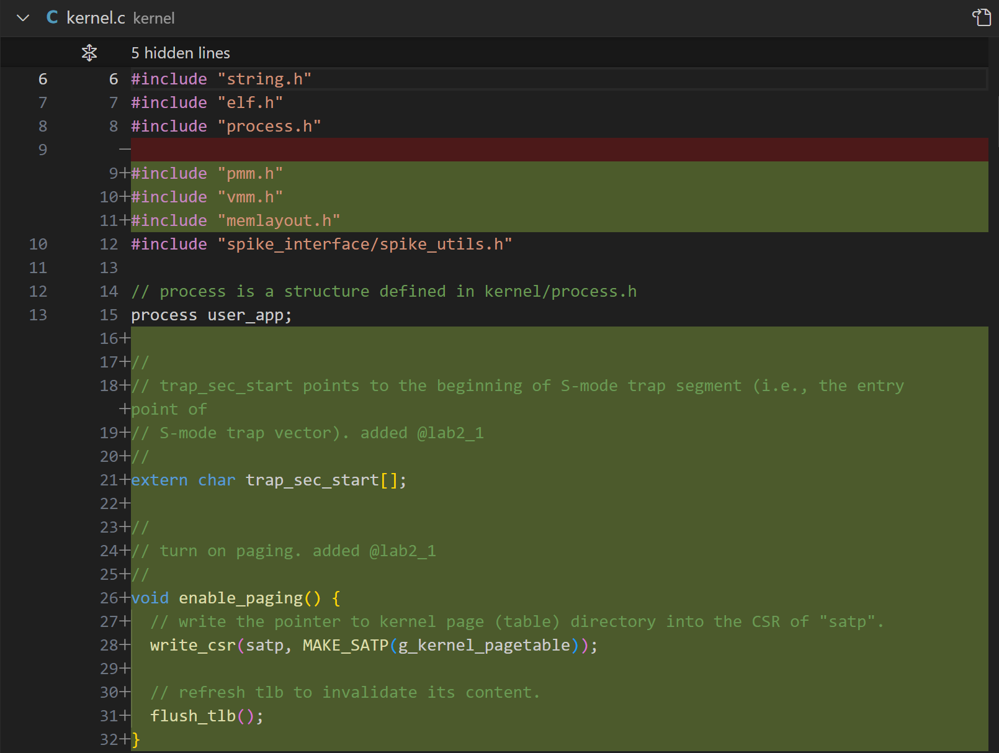


#### **1. 代码变更概述**
这次修改主要涉及 **分页机制的引入**，涉及的文件是 `kernel.c`，其变更包括：
- **头文件的调整**（新增 `pmm.h`、`vmm.h`、`memlayout.h`）。
- **`user_app` 进程结构体的定义**。
- **`trap_sec_start` 符号的声明**。
- **`enable_paging()` 函数的新增**（用于启用分页模式）。

#### **2. 具体变更分析**
 **(1) 头文件调整**
**移除：**
```c
#include "process.h"
```
**新增：**
```c
#include "pmm.h"
#include "vmm.h"
#include "memlayout.h"
```
- `pmm.h`（物理内存管理）：用于分配和管理物理页。
- `vmm.h`（虚拟内存管理）：用于操作页表，进行地址映射。
- `memlayout.h`（内存布局）：定义虚拟内存和物理内存的布局结构。

 **(2) 进程结构体 `user_app`**
```c
process user_app;
```
- `user_app` 是一个 `process` 结构体实例，应该用于管理用户进程的状态。
- 这表明 **PKE 代理内核现在开始支持进程管理**，不仅是裸机执行，而是进入了 **多进程管理的准备阶段**。

 **(3) `trap_sec_start`**
```c
extern char trap_sec_start[];
```
- `trap_sec_start` 标志着 **S-mode（Supervisor 模式）的陷阱段起始地址**，用于异常和中断处理。
- 这通常用于 `stvec`（Supervisor Trap Vector），指向异常入口代码的位置。

 **(4) `enable_paging()` 函数**
```c
void enable_paging() {
    // write the pointer to kernel page (table) directory into the CSR of "satp".
    write_csr(satp, MAKE_SATP(g_kernel_pagetable));

    // refresh tlb to invalidate its content.
    flush_tlb();
}
```
- 该函数 **正式启用了分页机制**，步骤如下：
  1. **将内核页表的根地址写入 `satp` 寄存器**：
     ```c
     write_csr(satp, MAKE_SATP(g_kernel_pagetable));
     ```
     - `satp`（Supervisor Address Translation and Protection Register）是 **RISC-V 用于分页机制的控制寄存器**。
     - `g_kernel_pagetable` 是 **内核的页表**，用于管理地址转换。
     - `MAKE_SATP()` 负责将 `g_kernel_pagetable` 格式化为 `satp` 可接受的格式（通常包括页表基地址和模式位）。
  
  2. **刷新 TLB（Translation Lookaside Buffer）**
     ```c
     flush_tlb();
     ```
     - TLB 是 **地址转换缓存**，它存储了最近访问的虚拟地址与物理地址的映射。
     - **切换页表后，必须清除 TLB，否则可能导致地址转换错误**。

---

#### **3. 变化的意义**
1. **分页机制正式引入**
   - 过去代理内核（PKE）直接使用物理地址执行，现在通过 `enable_paging()` 启用了 **基于页表的虚拟内存**。
   - 这为 **多进程管理、地址空间隔离** 提供了基础。

2. **用户进程管理的前置准备**
   - `user_app` 进程结构体的定义，表明后续可能会实现进程调度。

3. **异常处理的改进**
   - `trap_sec_start` 表明内核开始配置 `stvec`，即 **S-mode 下的异常向量表**，用于异常/中断处理。

---

#### **4. 结论**
这次修改标志着 **PKE 代理内核正式进入分页模式**，核心更新包括：
- **分页机制启用（`enable_paging()`）**
- **进程管理前置准备（`user_app`）**
- **异常向量入口的定义（`trap_sec_start`）**

---
### **用户进程加载的虚拟内存支持**

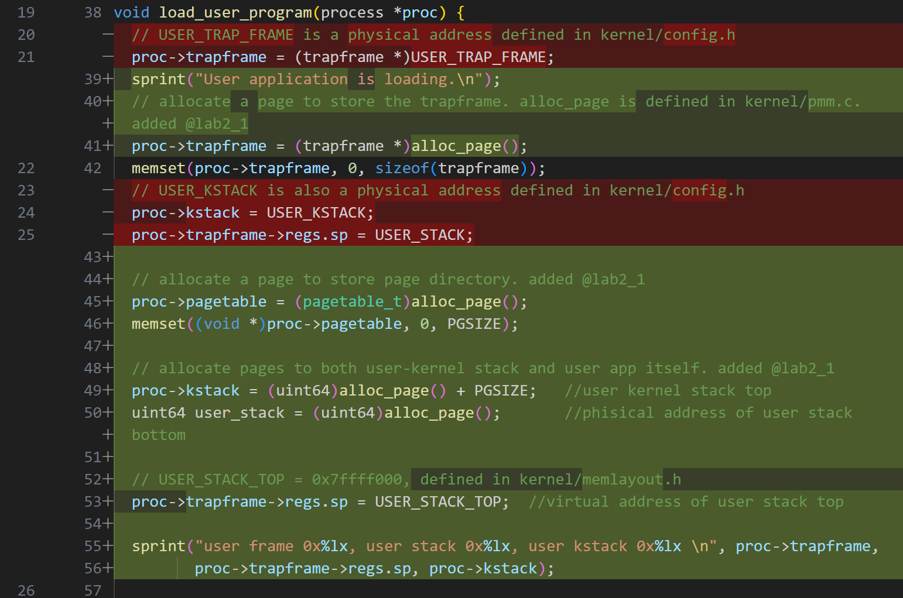


#### **1. 代码变更概述**
本次修改集中在 `load_user_program(process *proc)` 这个函数，它负责 **为用户进程分配资源**，包括 **陷阱帧（trapframe）、内核栈（kstack）、页表（pagetable）和用户栈（user stack）**。  
修改主要体现在：
- **将物理地址的直接赋值改为通过 `alloc_page()` 进行动态分配**。
- **用户栈的地址从物理地址 `USER_STACK` 变成了虚拟地址 `USER_STACK_TOP`**，适配分页模式。
- **新增 `pagetable` 分配，为进程建立自己的页表**。

---

#### **2. 具体变更分析**
 **(1) 陷阱帧（Trapframe）**
**旧代码（红色 - 被删除部分）**
```c
proc->trapframe = (trapframe *)USER_TRAP_FRAME;
```
- 过去 `trapframe` 直接分配在固定的物理地址 `USER_TRAP_FRAME`，这个地址是在 `kernel/config.h` 里定义的。
- 这种方式仅适用于 **裸机模式（Bare Mode）**，因为进程共享这个地址，没有页表映射。

**新代码（绿色 - 现在的实现）**
```c
proc->trapframe = (trapframe *)alloc_page();
memset(proc->trapframe, 0, sizeof(trapframe));
```
- 现在 `trapframe` **改为动态分配**，使用 `alloc_page()` 申请一个独立的物理页。
- `memset()` 清零，以避免使用未初始化数据。
- 这表明 **PKE 现在支持多个进程，每个进程都能拥有自己的陷阱帧**，这对多进程环境至关重要。

---

 **(2) 进程页表（Pagetable）**
**新增代码**
```c
proc->pagetable = (pagetable_t)alloc_page();
memset((void *)proc->pagetable, 0, PGSIZE);
```
- 过去 `load_user_program()` 并不会 **为进程分配页表**，说明过去的实现是假定所有进程共享同一个页表（即裸机模式）。
- 现在为 `proc->pagetable` **分配了一页物理内存**，用来存储页表结构。
- 这样，每个用户进程都能有自己独立的页表，**实现虚拟地址隔离**。

---

 **(3) 用户内核栈 & 用户应用栈**
**旧代码**
```c
proc->kstack = USER_KSTACK;
proc->trapframe->regs.sp = USER_STACK;
```
- `USER_KSTACK` 和 `USER_STACK` 过去是 **静态的物理地址**，存放在 `config.h` 里，适用于裸机模式。
- 在分页模式下，这种方式不可行，因为进程的 **内核栈和用户栈应该在虚拟地址空间内分配**。

**新代码**
```c
proc->kstack = (uint64)alloc_page() + PGSIZE;  // user kernel stack top
uint64 user_stack = (uint64)alloc_page();  // physical address of user stack
proc->trapframe->regs.sp = USER_STACK_TOP;  // virtual address of user stack top
```
- **`alloc_page()` 申请物理内存**，用于存放 **用户态栈和内核态栈**。
- **`proc->kstack = alloc_page() + PGSIZE`**：
  - `alloc_page()` 返回页的基地址，而 `kstack` 需要指向 **栈顶**，所以加上 `PGSIZE`。
- **`USER_STACK_TOP` 取代了 `USER_STACK`**：
  - `USER_STACK_TOP` 是一个 **虚拟地址**，定义在 `memlayout.h`。
  - 过去 `USER_STACK` 直接指向物理地址，现在它指向 **进程的虚拟地址空间**。

---

#### **3. 变化的意义**
1. **用户进程支持独立页表**
   - 过去所有用户进程共用一个页表，现在 `proc->pagetable` 由 `alloc_page()` 申请，意味着 **每个进程都有自己的页表**。
   - 这使得 PKE 代理内核 **支持虚拟内存和多进程**。

2. **用户栈和内核栈动态分配**
   - 过去 `USER_STACK` 和 `USER_KSTACK` 是固定物理地址，现在它们被改为 **动态分配的物理页**。
   - 这使得每个进程都能有自己的栈，而不会相互覆盖。

3. **陷阱帧不再是共享的静态地址**
   - `proc->trapframe` 现在是动态分配的，这意味着 **每个进程的 `trapframe` 是独立的**。
   - 以前所有进程共用 `USER_TRAP_FRAME`，导致陷阱处理逻辑不支持多进程。

4. **用户栈地址变成了虚拟地址**
   - `proc->trapframe->regs.sp = USER_STACK_TOP` **表明进程运行时栈的地址现在是虚拟地址**。
   - 过去 `regs.sp` 直接使用 `USER_STACK`（物理地址），现在它通过分页机制，指向进程自己的 **虚拟地址空间**。

---

#### **4. 结论**
本次修改标志着 PKE 代理内核的 **用户进程管理完全进入分页模式**：
- **用户进程有了独立的页表**（`proc->pagetable`）。
- **栈和陷阱帧都是动态分配的**，不再使用固定物理地址。
- **用户栈的地址是虚拟地址**，不再直接使用物理地址。

这表明 **PKE 代理内核正在向完整的用户态进程管理演进，为未来实现用户态程序提供了基础**。

---
### **用户进程的页表映射**

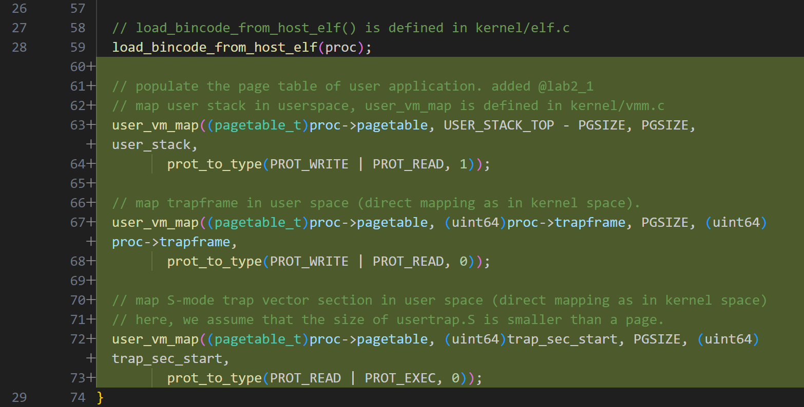


#### **1. 代码变更概述**
本次修改主要涉及 **用户进程的虚拟地址映射**，引入了 `user_vm_map()`，用于将：
- **用户栈**
- **用户陷阱帧**
- **S-mode 陷阱向量**

映射到用户进程的页表中。这标志着 **用户进程的地址空间正式由页表管理，而非直接使用物理地址**。

---

#### **2. 具体变更分析**
 **(1) 加载 ELF**
```c
load_bincode_from_host_elf(proc);
```
- `load_bincode_from_host_elf()` 负责从 ELF 文件加载用户程序代码。
- 这意味着 **用户态程序的数据段、代码段已经被加载**，后续需要 **配置页表** 让进程能够访问它们。

---

 **(2) 映射用户栈**
```c
user_vm_map((pagetable_t)proc->pagetable, USER_STACK_TOP - PGSIZE, PGSIZE,
            user_stack,
            prot_to_type(PROT_WRITE | PROT_READ, 1));
```
- **将用户栈映射到 `USER_STACK_TOP - PGSIZE`**。
- `user_stack` 是 **物理地址**，`USER_STACK_TOP - PGSIZE` 是 **虚拟地址**。
- `PROT_WRITE | PROT_READ` 允许用户进程读写该栈。
- **`1` 代表用户态可访问**，意味着这是 **用户进程的私有栈**。

**意义**
- 过去 `proc->trapframe->regs.sp = USER_STACK_TOP` 只是设置寄存器，现在实际将 **用户栈的物理页映射到用户地址空间**。

---

 **(3) 映射 `trapframe`**
```c
user_vm_map((pagetable_t)proc->pagetable, (uint64)proc->trapframe, PGSIZE,
            (uint64)proc->trapframe,
            prot_to_type(PROT_WRITE | PROT_READ, 0));
```
- `trapframe` 现在映射到用户态页表，地址相同（直接映射）。
- `PROT_WRITE | PROT_READ` 允许修改 `trapframe`，但 **`0` 代表内核态访问**。

**意义**
- 这样，用户进程的陷阱帧可以存储在 **虚拟地址空间**，而不是直接使用裸机物理地址。

---

 **(4) 映射 S-mode 陷阱向量**
```c
user_vm_map((pagetable_t)proc->pagetable, (uint64)trap_sec_start, PGSIZE,
            (uint64)trap_sec_start,
            prot_to_type(PROT_READ | PROT_EXEC, 0));
```
- `trap_sec_start` 是 S-mode 下的陷阱向量，过去只在 **内核地址空间** 可访问，现在也映射到 **用户进程的虚拟地址空间**。
- `PROT_READ | PROT_EXEC` 允许执行该代码，但不允许写入。

**意义**
- 让用户态程序也能正确进入 **S-mode** 处理陷阱（syscall、异常）。

---

#### **3. 变化的意义**
1. **用户进程完全基于页表运行**
   - 过去 `load_user_program()` 只是在物理地址上直接运行，现在真正地 **创建了用户进程的虚拟地址空间**。

2. **支持进程独立栈**
   - 过去所有进程共用固定物理地址 `USER_STACK`，现在每个进程都有自己的 **用户栈（user_stack）** 并通过页表管理。

3. **用户进程能够正确执行系统调用**
   - 过去 `trapframe` 直接存放在物理地址，现在 `trapframe` 是用户进程的一部分，并通过页表映射，使得用户态进程能够正确进入 **S-mode** 处理异常。

---

#### **4. 结论**
本次修改完成了 **用户进程地址空间的核心映射**：
- **用户栈被映射到虚拟地址**
- **陷阱帧被存储在用户地址空间**
- **S-mode 陷阱向量可被用户态访问**

这标志着 **PKE 代理内核的虚拟内存机制已经完整支持用户进程**，使得进程真正运行在 **独立的虚拟地址空间**，而不是共享裸机物理地址。

---
### **内核启动流程从裸机模式切换到分页模式**

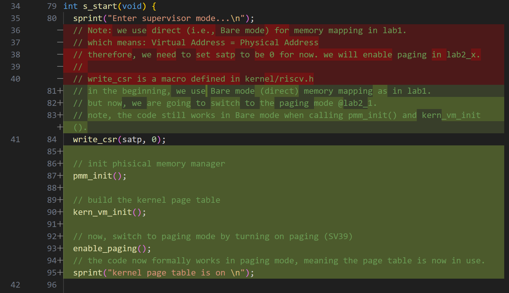


#### **1. 代码变更概述**
本次修改发生在 `s_start(void)` 函数，该函数是 **内核进入 S-mode（超级模式）后的初始化流程**。  
主要变化：
- **删除了裸机模式（Bare mode）相关的注释**
- **新增分页模式（Paging mode）的初始化**
- **添加 `enable_paging()` 以切换到 SV39 分页模式**

---

#### **2. 具体变更分析**
 **(1) 移除裸机模式的说明**
**被删除的注释**
```c
// Note: we use direct (i.e., Bare mode) for memory mapping in lab1.
// which means: Virtual Address = Physical Address
// therefore, we need to set satp to be 0 for now. we will enable paging in lab2_x.
// write_csr is a macro defined in kernel/riscv.h
```
- **之前的代码假设内核运行在裸机模式**（Bare mode），即 **虚拟地址 == 物理地址**，所以 `satp = 0`。
- 这种方式在 **没有分页管理的情况下适用**，但随着 **分页模式的引入，这种方式被淘汰**。

**新增的注释**
```c
// in the beginning, we use Bare mode (direct) memory mapping as in lab1.
// but now, we are going to switch to the paging mode @lab2_1.
// note, the code still works in Bare mode when calling pmm_init() and kern_vm_init().
```
- **明确了代码的过渡阶段**：
  1. `pmm_init()` 和 `kern_vm_init()` 仍然在裸机模式下运行。
  2. 但随后 `enable_paging()` 会切换到分页模式（SV39）。

---

 **(2) `write_csr(satp, 0);` 仍然保留**
```c
write_csr(satp, 0);
```
- **为什么还要清空 `satp`？**
  - 在分页模式正式开启前，仍然要 **确保裸机模式运行的正确性**。
  - 这个设置可能是 **一个安全措施**，确保 `pmm_init()` 和 `kern_vm_init()` **在干净的地址空间下初始化**。

---

 **(3) 初始化物理内存管理**
```c
pmm_init();
```
- `pmm_init()` 负责初始化 **物理内存管理器**，为后续的 **动态内存分配、页面分配** 提供支持。
- 这一步依然在 **裸机模式（Bare mode）** 下执行。

---

 **(4) 构建内核页表**
```c
kern_vm_init();
```
- `kern_vm_init()` 负责 **创建内核页表**，但此时仍然**未正式启用**分页机制。
- 页表构建完成后，才可以安全地 **切换到分页模式**。

---

 **(5) 启用分页模式**
```c
enable_paging();
```
- `enable_paging()` 通过 **写入 `satp` 寄存器**，正式开启 **SV39 分页模式**。
- **此时，内核开始使用页表进行地址转换**。

---

 **(6) 分页模式开启后，打印确认信息**
```c
sprint("kernel page table is on \n");
```
- **确认分页机制已经开启**，表明 **所有后续的地址访问将通过页表映射**。

---

#### **3. 变化的意义**
1. **内核从裸机模式切换到分页模式**
   - `pmm_init()` 和 `kern_vm_init()` 仍然在裸机模式下运行。
   - `enable_paging()` 调用后，正式进入 **SV39 分页模式**。

2. **内核页表成为基础**
   - `kern_vm_init()` 先 **创建页表**，`enable_paging()` 再 **切换到分页模式**。
   - **所有进程的虚拟地址映射都基于这个内核页表**。

3. **确保切换过程安全**
   - `write_csr(satp, 0);` 确保 `pmm_init()` 在 **干净的裸机模式下运行**。
   - 只有在 **页表正确构建后，才切换到分页模式**。

---

#### **4. 结论**
本次修改 **完成了从裸机模式（Bare mode）向分页模式（Paging mode）过渡的关键步骤**：
- **物理内存管理初始化**
- **构建内核页表**
- **正式启用分页（SV39）**

这标志着 **PKE 代理内核的虚拟内存管理正式生效**，所有进程的 **地址访问将通过页表映射，而不再直接使用物理地址**。

---

### `process.c`
### **进程切换到用户态的改进**
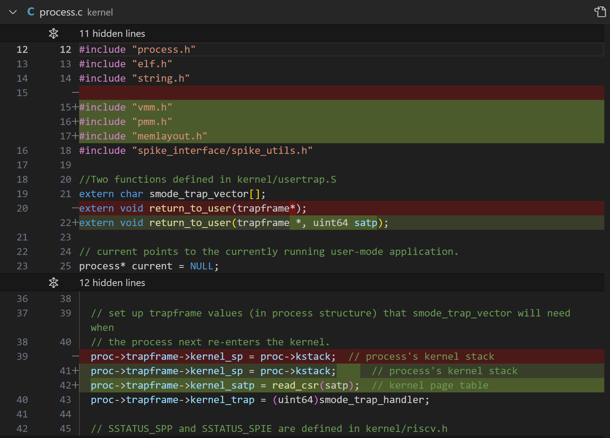


#### **1. 代码变更概述**
本次修改主要针对 **`return_to_user()`** 过程，它用于 **从内核返回用户态**。  
改进点：
- **`return_to_user()` 现在额外接受 `satp` 参数**
- **在 `trapframe` 结构中增加了 `kernel_satp` 字段**
- **在 `trapframe` 中保存 `satp` 和 `smode_trap_handler`**

这标志着 **用户态进程的页表切换开始受到内核管理**。

---

#### **2. 具体变更分析**
 **(1) `return_to_user()` 现在接受 `satp`**
- 过去，`return_to_user()` 仅接受 `trapframe *`，意味着它不显式管理 `satp`。
- 现在，它额外接受 `satp`，表明在 **切换到用户态前，内核会显式指定页表**。
- **重要意义**：
  - 过去 `satp` 可能隐式继承，现在它在 `return_to_user()` 调用时被**明确传递**，让用户进程在恢复时**加载正确的页表**。

---

 **(2) `trapframe` 结构体新增 `kernel_satp`**
- 过去，只存储了 **内核栈指针**，但没有存储 `satp`，切换到用户态时不会显式恢复 `satp`。

- **新增 `kernel_satp` 字段**：
  - `kernel_satp = read_csr(satp)` **记录当前的 `satp` 值**，确保切换回内核态时可以正确恢复内核页表。
  - 这样，当发生 **syscall 或异常时，内核可以切换回自己的页表**。

---

#### **3. 变化的意义**
1. **用户态切换页表的管理更加明确**
   - 过去，用户态进程可能继承 `satp`，现在 **在 `return_to_user()` 调用时显式传递**，确保 **切换到正确的页表**。

2. **异常返回时能正确恢复内核态**
   - `trapframe` 现在保存 `kernel_satp`，意味着 **当用户进程陷入异常时，能够正确恢复内核页表**。
   - 这样，**内核和用户态的地址空间管理更加独立**。

3. **提高用户态隔离**
   - 过去，用户态和内核的 `satp` 可能是混用的，而现在，每次切换都会 **手动加载 `satp`**，提高了 **内核安全性**。

---

#### **4. 结论**
本次修改完善了 **用户态进程的页表管理**：
- **返回用户态时，明确指定 `satp`**
- **`trapframe` 记录 `kernel_satp`，确保异常时恢复**
- **改进 `return_to_user()` 逻辑，使得进程上下文切换更加健壮**

这为 **未来支持多个进程调度** 和 **用户态隔离** 提供了更好的基础。

---
### **用户态进程切换时的 `satp` 管理**
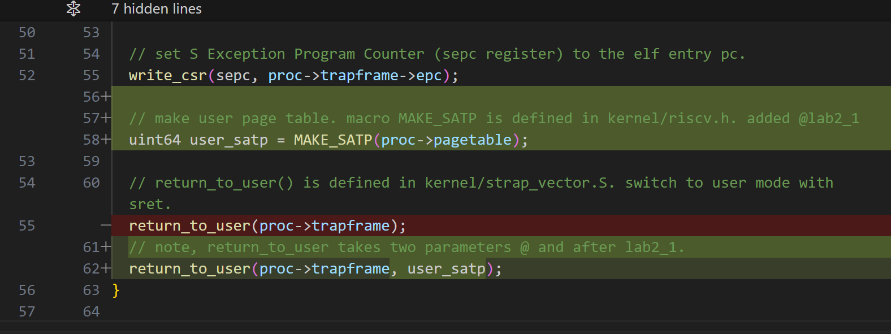


#### **1. 代码变更概述**
本次修改针对 **`return_to_user()` 过程**，用于 **从内核切换到用户态**，关键改动：
- **在进入用户态前，明确设置 `satp`**
- **`return_to_user()` 现在需要 `trapframe` 和 `satp`**
- **新增 `user_satp` 变量，确保切换到用户态时正确加载页表**

---

#### **2. 具体变更分析**
 **(1) 设置 `sepc`**
```c
write_csr(sepc, proc->trapframe->epc);
```
- **`sepc`（S-mode Exception Program Counter）** 用于存储 **陷入 S-mode 时的返回地址**。
- **这里将 `sepc` 设为 `trapframe->epc`，意味着进程恢复执行后，会从 `epc` 指定的位置继续运行**。

---

 **(2) 计算 `user_satp`**
```c
uint64 user_satp = MAKE_SATP(proc->pagetable);
```
- **`MAKE_SATP(pagetable)`** 用于构造 **RISC-V `satp` 值**：
  - `satp` 是 **RISC-V 用于分页管理的控制寄存器**，存储当前使用的页表。
  - `proc->pagetable` 是用户进程的页表。
  - `MAKE_SATP()` 将 `proc->pagetable` 格式化为 `satp` 需要的值（通常包括 **页表基地址和模式位**）。

---

 **(3) `return_to_user()` 现在需要 `satp`**
**旧代码**
```c
return_to_user(proc->trapframe);
```
- 过去 `return_to_user()` 只接受 `trapframe *`，不显式指定 `satp`。
- 这样 `satp` 可能继承自上一次进程，可能导致错误。

**新代码**
```c
return_to_user(proc->trapframe, user_satp);
```
- **`return_to_user()` 现在明确要求 `satp`**，确保：
  1. **在用户态下，正确使用用户进程的页表**
  2. **防止 `satp` 继承自内核，导致地址空间混乱**
  3. **为未来支持多进程调度提供基础**

---

#### **3. 变化的意义**
1. **用户态进程的页表切换更加安全**
   - 过去 `satp` 可能是隐式继承的，现在 **进入用户态时会显式加载 `satp`**，避免错误。

2. **确保 `sepc` 和 `satp` 同时设置**
   - `sepc` 确保返回正确的用户代码位置。
   - `satp` 确保用户进程 **在正确的页表下运行**。

3. **增强对多进程支持**
   - 未来如果有多个用户进程，每个进程都会有自己的 `satp`。
   - 现在 `return_to_user()` 直接使用 `user_satp`，**未来切换进程时，可以动态选择合适的页表**。

---

#### **4. 结论**
本次修改完善了 **从内核返回用户态的页表管理**：
- **`return_to_user()` 需要 `satp`，不再隐式继承**
- **用户态进程切换时，`satp` 和 `sepc` 均明确设置**
- **提高安全性，为未来支持多进程调度打下基础**

---

### `process.h`
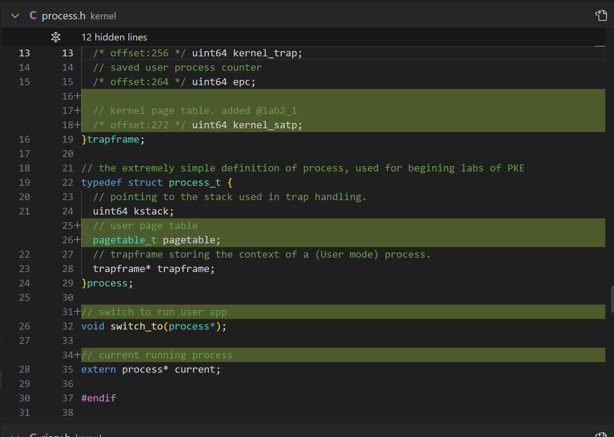
### **进程结构的增强：支持用户页表管理**

#### **1. 代码变更概述**
本次修改主要增强了 **`process_t` 结构**，为用户进程管理 **添加了页表字段**，同时扩展了 `trapframe` 结构，主要变化：
- **`trapframe` 结构增加 `kernel_satp`**
- **`process_t` 结构增加 `pagetable` 字段**
- **新增 `switch_to(process *)` 用于进程切换**
- **新增 `current` 指针指向当前运行的进程**

这些改动为 **多进程支持和用户页表管理** 打下了基础。

---

#### **2. 具体变更分析**
 **(1) `trapframe` 结构新增 `kernel_satp`**
```c
/* offset:272 */ uint64 kernel_satp;
```
- `kernel_satp` **用于存储内核页表地址**。
- 这个字段的作用是 **在用户进程陷入 S-mode 时，能够正确恢复内核的页表**，防止地址空间错乱。
- 过去，切换回 S-mode 时 **可能继承错误的 `satp`**，现在 `kernel_satp` 让 **页表切换更加安全**。

---

 **(2) `process_t` 结构新增 `pagetable`**
```c
pagetable_t pagetable;
```
- `pagetable` 是 **用户进程的页表**。
- 过去，所有用户进程可能共用 **一个全局页表**，而现在，每个进程有自己的 **独立页表**，提高了**进程隔离性**。

**意义**
- 让每个用户进程可以拥有自己的 **独立地址空间**，防止进程间数据干扰。
- **多进程切换时，可以动态更改 `satp` 以切换页表**。

---

 **(3) `switch_to(process *)`**
```c
void switch_to(process *);
```
- 这个函数的作用是 **在多个用户进程之间切换**。
- 未来如果支持多个用户进程，**`switch_to()` 可能会调整 `satp` 并调用 `return_to_user()` 以切换进程**。

---

 **(4) `current` 变量**
```c
extern process* current;
```
- `current` **指向当前正在运行的进程**。
- 这个变量未来会在 **进程调度、系统调用处理等核心功能中使用**，确保内核始终知道**当前执行的是哪个进程**。

---

#### **3. 变化的意义**
1. **支持用户进程的独立页表**
   - `pagetable` 使得 **每个用户进程都有自己的地址空间**，不会相互干扰。
   - 未来可以实现 **进程调度时动态切换页表**。

2. **提高进程切换的安全性**
   - `kernel_satp` 确保 **用户进程陷入 S-mode 时，正确恢复内核页表**，防止 `satp` 继承错误数据。

3. **为多进程管理提供基础**
   - `switch_to(process *)` 和 `current` 变量，为 **多进程调度** 和 **进程管理** 提供了基础设施。

---

#### **4. 结论**
本次修改提升了 **用户进程的独立性和安全性**：
- **每个进程有自己的页表** (`pagetable`)
- **进程陷入 S-mode 时，可以正确恢复 `satp`** (`kernel_satp`)
- **新增 `switch_to()` 和 `current`，为未来进程调度做准备**

这标志着 **PKE 代理内核向多进程支持迈出了关键一步**。

---

### `riscv.h`
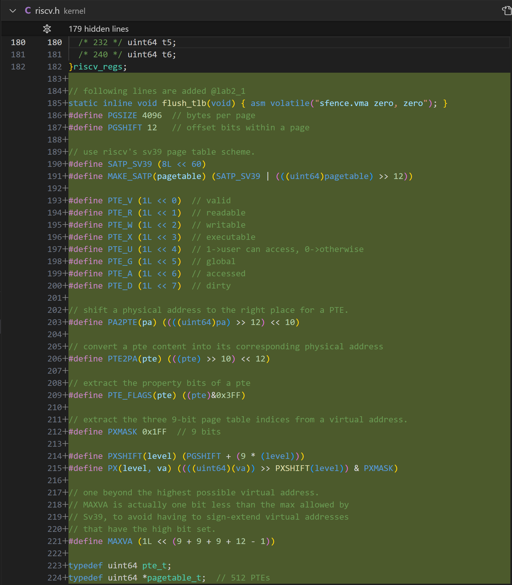
### **RISC-V SV39 页表管理的引入**

#### **1. 代码变更概述**
本次修改主要涉及 **RISC-V SV39 分页机制的定义和支持**，包括：
- **添加 `flush_tlb()`**：用于刷新 TLB
- **定义页表的关键参数**：
  - **`PGSIZE`**（页大小）
  - **`PGSHIFT`**（页偏移量）
- **引入 `SV39` 页表格式**：
  - **`SATP_SV39`** 和 **`MAKE_SATP(pagetable)`**
- **定义 PTE（页表项）标志位**
- **实现虚拟地址到物理地址的转换**

这些改动为 **PKE 代理内核正式引入 RISC-V 的 SV39 分页模式** 打下了基础。

---

#### **2. 具体变更分析**
 **(1) `flush_tlb()`**
```c
static inline void flush_tlb(void) { asm volatile("sfence.vma zero, zero"); }
```
- **`sfence.vma zero, zero`** 指令用于刷新 **TLB（地址转换缓冲区）**。
- 这样可以确保 **页表更新后，CPU 不会使用旧的地址转换缓存**。

---

 **(2) 页大小和偏移量**
```c
#define PGSIZE 4096 // bytes per page
#define PGSHIFT 12   // offset bits within a page
```
- **`PGSIZE`** 定义 **每个页的大小为 4KB**（RISC-V 典型分页大小）。
- **`PGSHIFT`** 表示 **页内偏移占用 12 位**。

---

 **(3) SV39 分页模式**
```c
#define SATP_SV39 (8L << 60)
#define MAKE_SATP(pagetable) (SATP_SV39 | (((uint64)pagetable) >> 12))
```
- **`SATP_SV39`**：`satp` 控制寄存器的 SV39 模式标志。
- **`MAKE_SATP(pagetable)`**：
  - 将 **页表的物理地址右移 12 位**，并与 **SV39 标志** 结合，形成 **`satp` 的完整值**。
  - 这表明 PKE 代理内核现在完全 **依赖 SV39 进行地址转换**。

---

 **(4) 页表项（PTE）标志位**
```c
#define PTE_V (1L << 0)  // valid
#define PTE_R (1L << 1)  // readable
#define PTE_W (1L << 2)  // writable
#define PTE_X (1L << 3)  // executable
#define PTE_U (1L << 4)  // user-accessible
#define PTE_G (1L << 5)  // global
#define PTE_A (1L << 6)  // accessed
#define PTE_D (1L << 7)  // dirty
```
- 这些标志用于控制页表项（PTE）的权限：
  - **`PTE_R`**：可读
  - **`PTE_W`**：可写
  - **`PTE_X`**：可执行
  - **`PTE_U`**：用户态进程可访问
  - **`PTE_A`**：已访问
  - **`PTE_D`**：已修改（写入）

这些标志对于 **用户态程序的内存管理至关重要**，它们决定了**哪些地址是可访问的**。

---

 **(5) 物理地址和 PTE 转换**
```c
#define PA2PTE(pa) ((((uint64)pa) >> 12) << 10)
#define PTE2PA(pte) (((pte) >> 10) << 12)
```
- **`PA2PTE(pa)`**：将 **物理地址转换为 PTE 格式**。
- **`PTE2PA(pte)`**：将 **PTE 解析为物理地址**。

**作用**：
- 在 **映射地址时，内核需要将物理地址存入 PTE**，使用 `PA2PTE()` 进行转换。
- 在 **解析页表项时，内核需要从 PTE 提取物理地址**，使用 `PTE2PA()`。

---

 **(6) 从虚拟地址提取页索引**
```c
#define PXSHIFT(level) (PGSHIFT + (9 * (level)))
#define PX(level, va) ((((uint64)(va)) >> PXSHIFT(level)) & PXMASK)
```
- **SV39 采用三级页表，每级索引 9 位**，该宏用于 **从虚拟地址提取每一级页索引**：
  - `PX(2, va)` 获取 **第三级（最高级）页表索引**。
  - `PX(1, va)` 获取 **第二级页表索引**。
  - `PX(0, va)` 获取 **第一级页表索引**（即 PTE）。

**作用**：
- **PKE 代理内核可以通过 `PX()` 遍历多级页表，实现虚拟地址到物理地址的映射**。

---

 **(7) 最大虚拟地址**
```c
#define MAXVA (1L << (9 + 9 + 9 + 12 - 1))
```
- **计算 SV39 最大虚拟地址**：
  - SV39 虚拟地址格式：`VPN2 | VPN1 | VPN0 | 页内偏移`
  - **`9 + 9 + 9 + 12 - 1 = 38`**，即 **虚拟地址范围是 2³⁸（256GB）**。

---

#### **3. 变化的意义**
1. **PKE 代理内核正式采用 SV39 分页模式**
   - `MAKE_SATP(pagetable)` 确保 **进程页表能正确加载到 `satp`**。

2. **实现基础的页表项（PTE）管理**
   - `PTE_V`、`PTE_R`、`PTE_W` 这些标志让 **PKE 能够管理进程内存的访问权限**。

3. **提供虚拟地址解析工具**
   - `PX(level, va)` 让 **内核可以解析虚拟地址，遍历页表**。

4. **支持多级页表映射**
   - 通过 `PA2PTE(pa)` 和 `PTE2PA(pte)`，PKE 代理内核可以 **正确存储和解析物理地址映射**。

---

#### **4. 结论**
本次修改 **正式为 PKE 代理内核引入 RISC-V SV39 分页机制**：
- **`flush_tlb()` 确保地址转换缓存正确更新**
- **`MAKE_SATP()` 让 `satp` 能正确加载用户进程页表**
- **PTE 结构提供基础的权限管理**
- **新增工具用于解析虚拟地址和多级页表索引**

这意味着 **PKE 代理内核现在可以完整支持用户进程的虚拟内存，并能正确进行页表管理**。

---

### `strap_vector.S`
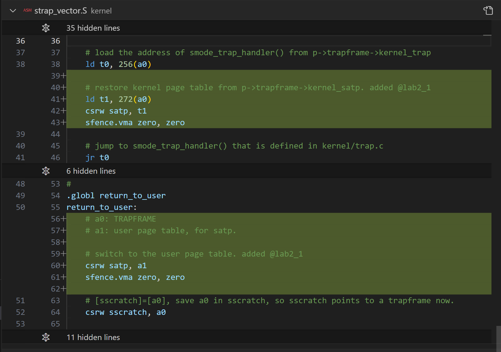
### **RISC-V `satp` 切换与陷阱处理的改进**

#### **1. 代码变更概述**
本次修改主要涉及 **RISC-V `satp`（页表基地址）切换** 以及 **陷阱处理机制的优化**，关键变化：
- **在 `strap_vector.S` 增加 `satp` 切换**
- **`return_to_user()` 现在手动加载用户页表**
- **从 `trapframe` 恢复 `kernel_satp`，确保异常返回时正确切换到内核页表**

这些改动确保 **用户态和内核态的页表正确切换**，防止地址空间混乱。

---

#### **2. 具体变更分析**
 **(1) 进入 S-mode 时恢复 `kernel_satp`**
```assembly
# load the address of smode_trap_handler() from p->trapframe->kernel_trap
ld t0, 256(a0)

# restore kernel page table from p->trapframe->kernel_satp. added @lab2_1
ld t1, 272(a0)
csrw satp, t1
sfence.vma zero, zero

# jump to smode_trap_handler() that is defined in kernel/trap.c
jr t0
```
- **当用户进程陷入 S-mode（发生异常或 syscall）时，代码需要执行 `smode_trap_handler()` 来处理**。
- **新增逻辑**：
  1. **`ld t1, 272(a0)`**  
     - 读取 `trapframe->kernel_satp`，即**内核页表基地址**。
  2. **`csrw satp, t1`**  
     - **切换到内核页表**，确保 S-mode 运行在正确的地址空间中。
  3. **`sfence.vma zero, zero`**  
     - 刷新 TLB，防止 `satp` 变更后仍使用旧的地址转换缓存。

**作用**
- 过去，用户进程可能在进入 S-mode 后仍然使用用户态页表，现在它会 **正确恢复到内核页表**。

---

 **(2) `return_to_user()` 现在手动切换 `satp`**
```assembly
.globl return_to_user
return_to_user:
    # a0: TRAPFRAME
    # a1: user page table, for satp

    # switch to the user page table. added @lab2_1
    csrw satp, a1
    sfence.vma zero, zero

    # [sscratch]=[a0], save a0 in sscratch, so sscratch points to a trapframe now.
    csrw sscratch, a0
```
- 过去 `return_to_user()` 仅恢复 `trapframe`，但不会修改 `satp`，导致 **可能仍然使用内核页表**。
- **新增逻辑**：
  1. **`csrw satp, a1`**  
     - `a1` 现在存储 **用户进程的 `satp`**，意味着切换到用户态时，会**加载进程自己的页表**。
  2. **`sfence.vma zero, zero`**  
     - 刷新 TLB，确保 **地址转换使用新页表**。
  3. **`csrw sscratch, a0`**  
     - `sscratch` 存放 `trapframe`，在异常发生时，可以立即获取 `trapframe` 信息。

**作用**
- `return_to_user()` 现在 **不仅仅恢复用户寄存器，还会切换 `satp`，确保用户进程运行在自己的虚拟地址空间中**。
- 过去 `satp` 可能继承了内核 `satp`，现在 **每次进入用户态时都会显式加载用户页表**，提高安全性。

---

#### **3. 变化的意义**
1. **用户态和内核态的 `satp` 切换更加清晰**
   - 过去 `satp` 可能不被正确恢复，导致用户进程仍然使用内核页表，现在手动切换 `satp` 解决了这个问题。

2. **异常进入 S-mode 时，确保恢复内核地址空间**
   - `trapframe->kernel_satp` 让内核在异常时 **能正确恢复自己的地址空间**。

3. **进程返回用户态时，确保使用正确的页表**
   - `return_to_user()` 现在明确切换 `satp`，避免进程在 **错误的地址空间** 中运行。

---

#### **4. 结论**
本次修改完善了 **用户态和 S-mode 的地址空间切换机制**：
- **进入 S-mode 时恢复 `kernel_satp`**
- **返回用户态时加载 `user_satp`**
- **确保每次 `satp` 变更后刷新 TLB**

这标志着 **PKE 代理内核的用户进程管理更加强大，可以支持独立的虚拟地址空间**。

---

### `syscall.c`
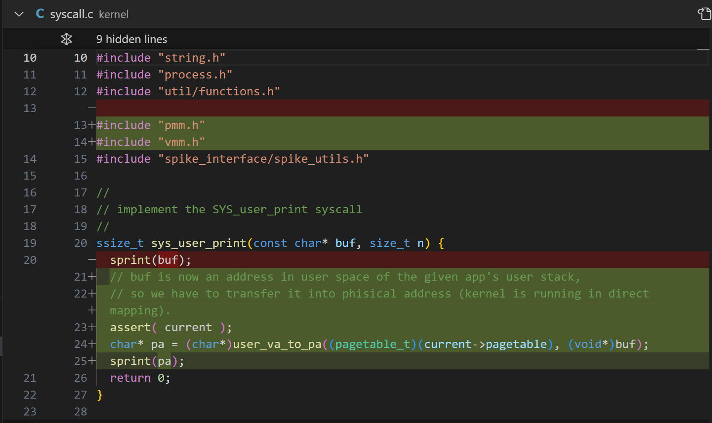
### **用户态 `sys_user_print` 系统调用的内存映射改进**

#### **1. 代码变更概述**
本次修改优化了 **`sys_user_print()` 系统调用**，主要变化：
- **移除了直接打印 `buf`**（因为它是用户态地址，不能直接在内核态访问）。
- **新增 `user_va_to_pa()` 将 `buf` 转换为物理地址**。
- **确保 `current` 进程存在，避免 `NULL` 访问**。

这些改动确保 **系统调用能够正确读取用户态传递的地址**，防止非法访问。

---

#### **2. 具体变更分析**
 **(1) 旧代码：直接打印 `buf`**
```c
sprint(buf);
```
- **`buf` 是用户态地址，但 `sprint()` 运行在内核态**。
- **问题**：
  - 在启用了分页模式后，内核不再直接访问用户进程的虚拟地址空间。
  - 如果 `buf` 不是内核可访问地址，可能导致 **非法内存访问**（Page Fault）。

---

 **(2) 解决方案：使用 `user_va_to_pa()`**
```c
assert( current );
char* pa = (char*)user_va_to_pa((pagetable_t)(current->pagetable), (void*)buf);
sprint(pa);
```
- **`assert(current);`**
  - **确保 `current` 进程非空**，防止 `NULL` 访问。

- **`user_va_to_pa(current->pagetable, buf)`**
  - `user_va_to_pa()` 用于 **将用户虚拟地址转换为物理地址**。
  - **`current->pagetable` 代表用户进程的页表**，`buf` 是用户传入的地址。
  - **返回的 `pa` 是对应的物理地址**，内核可以安全访问。

- **`sprint(pa);`**
  - **现在 `pa` 是物理地址**，可以安全打印，不会触发 **非法访问异常**。

---

#### **3. 变化的意义**
1. **内核避免直接访问用户态地址**
   - 过去，内核假定 **可以直接访问用户态指针**，但在分页模式下这不再适用。
   - 现在使用 `user_va_to_pa()` 进行转换，避免 **地址空间混乱**。

2. **支持分页模式的系统调用**
   - 现在 `sys_user_print()` 可以 **正确解析用户传递的指针**，确保数据可用。

3. **提高系统调用的安全性**
   - 通过 `assert(current);`，防止 `NULL` 访问。
   - 通过 `user_va_to_pa()`，确保访问 **经过页表映射的安全地址**。

---

#### **4. 结论**
本次修改 **完善了分页模式下的系统调用安全性**：
- **移除直接访问用户态地址的逻辑**
- **新增 `user_va_to_pa()` 确保地址转换正确**
- **系统调用 `sys_user_print()` 现在支持用户页表**

这标志着 **PKE 代理内核的系统调用机制更加安全，适配了分页模式**。

---

### 新增源代码文件
#### memlayout.h
```c
#ifndef _MEMLAYOUT_H
#define _MEMLAYOUT_H

// RISC-V machine places its physical memory above DRAM_BASE
#define DRAM_BASE 0x80000000

// the beginning virtual address of PKE kernel
#define KERN_BASE 0x80000000

// default stack size
#define STACK_SIZE 4096

// virtual address of stack top of user process
#define USER_STACK_TOP 0x7ffff000

#endif

```
## pmm.c
### **物理内存管理（pmm.c）的主要功能**

`pmm.c` 负责 **管理物理内存分配和回收**，它实现了一个 **基于链表的物理页分配器**，用于给内核和用户进程分配 **4KB 页大小的物理内存**。其核心功能如下：

---

### **1. 物理内存管理的初始化**
#### **`pmm_init()`**
- **计算可用的物理内存范围**：
  - 物理内存从 **内核结束地址 `_end`** 之后开始。
  - **`free_mem_start_addr = ROUNDUP(g_kernel_end, PGSIZE)`** 确保内存 **页对齐**。
  - 计算 `g_mem_size`，避免超出允许的物理内存范围 `PKE_MAX_ALLOWABLE_RAM`。

- **创建空闲页链表**：
  - 调用 `create_freepage_list(start, end)`，建立 **空闲物理页的链表**。
  - 这样，系统可以通过 `alloc_page()` 和 `free_page()` 动态分配和释放物理页。

---

### **2. 物理页的分配**
#### **`alloc_page()`**
```c
void *alloc_page(void) {
  list_node *n = g_free_mem_list.next;
  if (n) g_free_mem_list.next = n->next;

  return (void *)n;
}
```
- 从 `g_free_mem_list` 链表中取出 **第一个空闲页**，返回其地址。
- 如果没有可用页，则返回 `NULL`。

---

### **3. 物理页的回收**
#### **`free_page(void *pa)`**
```c
void free_page(void *pa) {
  if (((uint64)pa % PGSIZE) != 0 || (uint64)pa < free_mem_start_addr || (uint64)pa >= free_mem_end_addr)
    panic("free_page 0x%lx \n", pa);

  list_node *n = (list_node *)pa;
  n->next = g_free_mem_list.next;
  g_free_mem_list.next = n;
}
```
- **检查回收的页是否合法**（页对齐、地址在合法范围内）。
- **将回收的页插入 `g_free_mem_list`，供后续 `alloc_page()` 重新使用**。

---

### **4. 建立物理页链表**
#### **`create_freepage_list(uint64 start, uint64 end)`**
```c
static void create_freepage_list(uint64 start, uint64 end) {
  g_free_mem_list.next = 0;
  for (uint64 p = ROUNDUP(start, PGSIZE); p + PGSIZE < end; p += PGSIZE)
    free_page( (void *)p );
}
```
- **从 `free_mem_start_addr` 开始，以 4KB 为单位创建空闲页链表**。
- **遍历整个可用物理内存，并将每个物理页加入 `g_free_mem_list`**。

---

### **5. 关键数据结构**
```c
typedef struct node {
  struct node *next;
} list_node;

static list_node g_free_mem_list;
```
- **链表结构 `list_node`**：用于存储 **空闲物理页**。
- **`g_free_mem_list`**：指向 **当前可用的物理页链表**。

---

### **6. 主要作用**
- **初始化内存管理，计算可用物理内存范围**。
- **使用链表管理空闲物理页**，支持动态 **分配/释放 4KB 页**。
- **为内核和用户进程提供物理内存支持**。

---

### **7. 结论**
- **`pmm_init()` 计算物理内存范围并初始化空闲页列表**。
- **`alloc_page()` 分配物理页，`free_page()` 释放物理页**。
- **基于链表的物理页管理，提高内存利用率，支持分页机制**。

这为 **PKE 代理内核提供了动态物理内存管理的能力**，使得 **内核和用户进程可以安全、高效地分配和回收物理内存**。

---

#### pmm.h
```c
#ifndef _PMM_H_
#define _PMM_H_

// Initialize phisical memeory manager
void pmm_init();
// Allocate a free phisical page
void* alloc_page();
// Free an allocated page
void free_page(void* pa);

#endif
```
## vmm.c
### **虚拟内存管理（vmm.c）的主要功能**

`vmm.c` 负责 **RISC-V SV39 分页模式下的虚拟地址管理**，它提供了 **内核页表和用户页表的映射、地址转换和页表遍历**。其主要功能包括：

---

### **1. 建立虚拟地址映射**
#### **`map_pages()`**
```c
int map_pages(pagetable_t page_dir, uint64 va, uint64 size, uint64 pa, int perm) {
  uint64 first, last;
  pte_t *pte;

  for (first = ROUNDDOWN(va, PGSIZE), last = ROUNDDOWN(va + size - 1, PGSIZE);
      first <= last; first += PGSIZE, pa += PGSIZE) {
    if ((pte = page_walk(page_dir, first, 1)) == 0) return -1;
    if (*pte & PTE_V)
      panic("map_pages fails on mapping va (0x%lx) to pa (0x%lx)", first, pa);
    *pte = PA2PTE(pa) | perm | PTE_V;
  }
  return 0;
}
```
- **遍历虚拟地址范围 [va, va+size]，逐页建立映射到物理地址 [pa, pa+size]**。
- **使用 `page_walk()` 找到 PTE（页表项），如果 PTE 已存在则报错**。
- **设置 PTE 标志位，标记该页有效 (`PTE_V`) 并赋予权限**。

**作用**
- 允许 **内核和用户进程映射虚拟地址到物理地址**，从而支持分页模式。

---

### **2. 解析虚拟地址的页表项**
#### **`page_walk()`**
```c
pte_t *page_walk(pagetable_t page_dir, uint64 va, int alloc) {
  if (va >= MAXVA) panic("page_walk");

  pagetable_t pt = page_dir;

  for (int level = 2; level > 0; level--) {
    pte_t *pte = pt + PX(level, va);

    if (*pte & PTE_V) {  
      pt = (pagetable_t)PTE2PA(*pte);
    } else {  
      if(alloc && ((pt = (pte_t *)alloc_page(1)) != 0)){
        memset(pt, 0, PGSIZE);
        *pte = PA2PTE(pt) | PTE_V;
      } else return 0;
    }
  }

  return pt + PX(0, va);
}
```
- **逐级解析虚拟地址的页表项**（SV39 三级页表结构）。
- **如果 `alloc=1`，则在页表项不存在时分配新的页表**。

**作用**
- 允许 **查找虚拟地址对应的 PTE**，如果 PTE 不存在，可选择 **分配新的页表**。
- 该函数被 `map_pages()` 和 `lookup_pa()` 依赖。

---

### **3. 查询虚拟地址对应的物理地址**
#### **`lookup_pa()`**
```c
uint64 lookup_pa(pagetable_t pagetable, uint64 va) {
  pte_t *pte;
  uint64 pa;

  if (va >= MAXVA) return 0;

  pte = page_walk(pagetable, va, 0);
  if (pte == 0 || (*pte & PTE_V) == 0 || ((*pte & PTE_R) == 0 && (*pte & PTE_W) == 0))
    return 0;
  pa = PTE2PA(*pte);

  return pa;
}
```
- 通过 `page_walk()` 查找 **虚拟地址 `va` 对应的物理地址**。
- 如果 PTE 无效或无权限，则返回 `0`。

**作用**
- **用于转换用户态或内核态的虚拟地址到物理地址**。
- **`kern_vm_map()` 和 `user_vm_map()` 依赖该函数**。

---

### **4. 内核页表管理**
#### **`kern_vm_map()`**
```c
void kern_vm_map(pagetable_t page_dir, uint64 va, uint64 pa, uint64 sz, int perm) {
  if (map_pages(page_dir, va, sz, pa, perm) != 0) panic("kern_vm_map");
}
```
- **建立内核态的虚拟地址映射**。

#### **`kern_vm_init()`**
```c
void kern_vm_init(void) {
  pagetable_t t_page_dir;
  t_page_dir = (pagetable_t)alloc_page();
  memset(t_page_dir, 0, PGSIZE);

  kern_vm_map(t_page_dir, KERN_BASE, DRAM_BASE, (uint64)_etext - KERN_BASE,
         prot_to_type(PROT_READ | PROT_EXEC, 0));

  kern_vm_map(t_page_dir, (uint64)_etext, (uint64)_etext, PHYS_TOP - (uint64)_etext,
         prot_to_type(PROT_READ | PROT_WRITE, 0));

  g_kernel_pagetable = t_page_dir;
}
```
- **分配和初始化内核页表**。
- **映射 KERN_BASE 到 _etext（内核代码）**。
- **映射剩余的地址空间，允许内核访问用户空间**。

**作用**
- **建立内核地址空间映射**，确保 **内核代码可执行，数据可读写**。

---

### **5. 用户页表管理**
#### **`user_va_to_pa()`**
```c
void *user_va_to_pa(pagetable_t page_dir, void *va) {
  panic("You have to implement user_va_to_pa (convert user va to pa) to print messages in lab2_1.\n");
}
```
- **将用户进程的虚拟地址 `va` 转换为物理地址**（待实现）。

**作用**
- **用于用户态进程的地址转换**，让内核可以正确访问用户态数据。

#### **`user_vm_map()`**
```c
void user_vm_map(pagetable_t page_dir, uint64 va, uint64 size, uint64 pa, int perm) {
  if (map_pages(page_dir, va, size, pa, perm) != 0) {
    panic("fail to user_vm_map .\n");
  }
}
```
- **建立用户进程的虚拟地址映射**。

---

### **6. 关键数据结构**
```c
typedef uint64 pte_t;
typedef uint64 *pagetable_t;
```
- **`pagetable_t` 是页表指针**，指向一个 PTE 数组。
- **`pte_t` 代表一个 PTE（页表项）**，用于存储 **物理地址和权限信息**。

---

### **7. 主要作用**
- **管理内核和用户的虚拟地址空间**。
- **支持 `SV39` 三层页表结构**，提供 **地址映射和转换**。
- **支持分页模式，确保地址空间隔离**。

---

### **8. 结论**
- **`map_pages()` 映射虚拟地址到物理地址**。
- **`page_walk()` 遍历页表，查找或创建 PTE**。
- **`lookup_pa()` 查询虚拟地址对应的物理地址**。
- **`kern_vm_init()` 初始化内核页表**，确保 **内核代码和数据可访问**。
- **`user_vm_map()` 允许用户态进程建立自己的地址空间**。

本模块 **确保 PKE 代理内核支持分页模式，并提供安全的地址空间管理**。

---

## vmm.h
```c
#ifndef _VMM_H_
#define _VMM_H_

#include "riscv.h"

/* --- utility functions for virtual address mapping --- */
int map_pages(pagetable_t pagetable, uint64 va, uint64 size, uint64 pa, int perm);
// permission codes.
enum VMPermision {
  PROT_NONE = 0,
  PROT_READ = 1,
  PROT_WRITE = 2,
  PROT_EXEC = 4,
};

uint64 prot_to_type(int prot, int user);
pte_t *page_walk(pagetable_t pagetable, uint64 va, int alloc);
uint64 lookup_pa(pagetable_t pagetable, uint64 va);

/* --- kernel page table --- */
// pointer to kernel page directory
extern pagetable_t g_kernel_pagetable;

void kern_vm_map(pagetable_t page_dir, uint64 va, uint64 pa, uint64 sz, int perm);

// Initialize the kernel pagetable
void kern_vm_init(void);

/* --- user page table --- */
void *user_va_to_pa(pagetable_t page_dir, void *va);
void user_vm_map(pagetable_t page_dir, uint64 va, uint64 size, uint64 pa, int perm);

#endif

```

### 删除user.lds
不需要手动在裸机模式下直接分配段位置了。