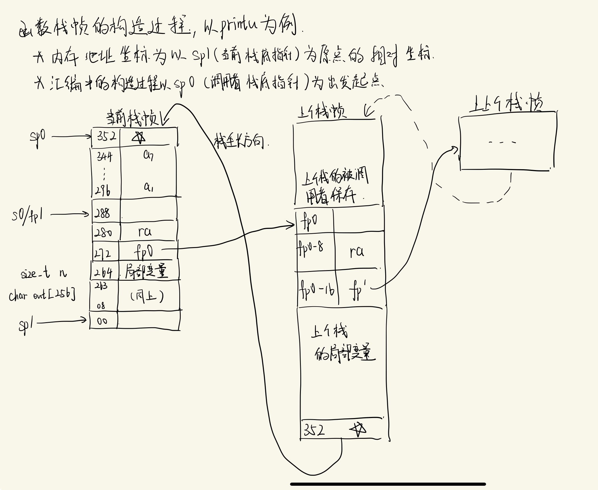

# `printu` 函数栈帧解析

## 汇编源代码
```asm
Dump of assembler code for function printu:
=> 0x0000000081000160 <+0>:     addi    sp,sp,-352 
   0x0000000081000162 <+2>:     sd      ra,280(sp)
   0x0000000081000164 <+4>:     sd      s0,272(sp)
   0x0000000081000166 <+6>:     addi    s0,sp,288
   0x0000000081000168 <+8>:     sd      a1,8(s0)
   0x000000008100016a <+10>:    sd      a2,16(s0)
   0x000000008100016c <+12>:    sd      a3,24(s0)
   0x000000008100016e <+14>:    sd      a4,32(s0)
   0x0000000081000170 <+16>:    sd      a5,40(s0)
   0x0000000081000172 <+18>:    sd      a6,48(s0)
   0x0000000081000176 <+22>:    sd      a7,56(s0)
   0x000000008100017a <+26>:    addi    a3,s0,8
   0x000000008100017e <+30>:    sd      a3,-24(s0)
   0x0000000081000182 <+34>:    mv      a2,a0
   0x0000000081000184 <+36>:    li      a1,256
   0x0000000081000188 <+40>:    addi    a0,s0,-280
   0x000000008100018c <+44>:    jal     0x8100036c <vsnprintf>
   0x0000000081000190 <+48>:    li      a5,255
   0x0000000081000194 <+52>:    bltu    a5,a0,0x810001b8 <printu+88>
   0x0000000081000198 <+56>:    mv      a2,a0
   0x000000008100019a <+58>:    li      a7,0
   0x000000008100019c <+60>:    li      a6,0
   0x000000008100019e <+62>:    li      a5,0
   0x00000000810001a0 <+64>:    li      a4,0
   0x00000000810001a2 <+66>:    li      a3,0
   0x00000000810001a4 <+68>:    addi    a1,s0,-280
   0x00000000810001a8 <+72>:    li      a0,64
   0x00000000810001ac <+76>:    jal     0x81000144 <do_user_call>
   0x00000000810001b0 <+80>:    ld      ra,280(sp)
   0x00000000810001b2 <+82>:    ld      s0,272(sp)
   0x00000000810001b4 <+84>:    addi    sp,sp,352
   0x00000000810001b6 <+86>:    ret
   0x00000000810001b8 <+88>:    li      a2,256
   0x00000000810001bc <+92>:    j       0x8100019a <printu+58>
```

## C源代码
```c
//
// printu() supports user/lab1_1_helloworld.c
//
int printu(const char* s, ...) {
  va_list vl;
  va_start(vl, s);

  char out[256];  // fixed buffer size.
  int res = vsnprintf(out, sizeof(out), s, vl);
  va_end(vl);


  const char* buf = out;
  size_t n = res < sizeof(out) ? res : sizeof(out);

  // make a syscall to implement the required functionality.
  return do_user_call(SYS_user_print, (uint64)buf, n, 0, 0, 0, 0, 0);
}

```
## 汇编帧构造过程图解
