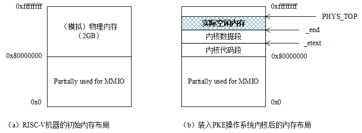

# 实验2的基础知识

## 引用

[spike仿真层](../doc/Spike仿真层.md)

## lab2开始时对于内核源代码的改动一览
[lab2源代码改动分析](../code/lab2_update.md)

## spike仿真层

[spike仿真层](../doc/Spike仿真层.md)

概括来说，Spike 仿真器提供了一个 完整的 RISC-V 虚拟硬件层。它通过 模拟 RISC-V 处理器、虚拟内存管理、外设抽象、中断与异常处理等功能，在宿主机上仿真 RISC-V 硬件，提供了一个 虚拟的 RISC-V 计算平台。通过这种方式，开发者能够在不依赖实际硬件的情况下，进行 RISC-V 软件开发、调试和性能分析。

## Sv39虚地址管理方案
>这部分原文档写得挺清楚的，就直接引用了

在RISC-V的sv39虚地址管理方案中，逻辑地址（就是我们的程序中各个符号，在链接时被赋予的地址）通过页表转换为其对应的物理地址。由于我们考虑的机器采用了RV64G指令集，意味着逻辑地址和物理地址理论上都是64位的。然而，对于逻辑地址，实际上我们的应用规模还用不到全部64位的寻找空间，所以Sv39方案中只使用了64位虚地址中的低39位（Sv48方案使用了低48位），意味着我们的应用程序的地址空间可以到512GB；对于物理地址，目前的RISC-V设计只用到了其中的低56位。

Sv39将39位虚拟地址“划分”为4个段（如下图所示）：

- [38,30]：共9位，图中的VPN[2]，用于在512（2^9）个页目录（page directory）项中检索页目录项（page directory entry, PDE）；
- [29,21]：共9位，图中的VPN[1]，用于在512（2^9）个页中间目录（page medium directory）中检索PDE；
- [20,12]：共9位，图中的VPN[0]，用于在512（2^9）个页表（page medium directory）中检索PTE；
- [11,0]：共12位，图中的offset，充当4KB页的页内位移。

图4.1 Sv39中虚拟地址到物理地址的转换过程

由于每个物理页的大小为4KB，同时，每个目录项（PDE）或页表项（PTE）占据8个字节，所以一个物理页能够容纳的PDE或PTE的数量为4KB/8B=512，这也是为什么VPN[2]=VPN[1]=VPN[0]=512的原因。

8字节的PDE或者PTE的格式如下：

图4.2 Sv39中PDE/PTE格式

其中的各个位的含意为：

● V（Valid）位决定了该PDE/PTE是否有效（V=1时有效），即是否有对应的实页。

● R（Read）、W（Write）和X（eXecutable）位分别表示此页对应的实页是否可读、可写和可执行。这3个位只对PTE有意义，对于PDE而言这3个位都为0。

● U（User）位表示该页是不是一个用户模式页。如果U=1，表示用户模式下的代码可以访问该页，否则就表示不能访问。S模式下的代码对U=1页面的访问取决于sstatus寄存器中的SUM字段取值。

● G（Global）位表示该PDE/PTE是不是全局的。我们可以把操作系统中运行的一个进程，认为是一个独立的地址空间，有时会希望某个虚地址空间转换可以在一组进程中共享，这种情况下，就可以将某个PDE的G位设置为1，达到这种共享的效果。

● A（Access）位表示该页是否被访问过。

● D（Dirty）位表示该页的内容是否被修改。

● RSW位（2位）是保留位，一般由运行在S模式的代码（如操作系统）来使用。

● PPN（44位）是物理页号（Physical Page Number，简写为PPN）。

其中PPN为44位的原因是：对于物理地址，现有的RISC-V规范只用了其中的56位，同时，这56位中的低12位为页内位移。所以，PPN的长度=56-12=44（位）。

## RISC-V内存布局与规划与MMIO特点

### 用户进程的虚实地址映射关系
- 机器（或者仿真层）实际的物理内存资源的编址，是从0x80000000开始的。
- 对于用户进程的 0x80000000 以上虚拟地址，通过页表变换映射到独立的物理内存，不同进程之间相互隔离。
- 对于用户进程的 0x80000000 以下虚拟地址，通常不进行页表转换，而是直接映射到固定的硬件设备。
- 通常情况下，用户进程不会直接访问 0x80000000 以下的 MMIO 地址，而是通过内核 syscall 让内核代为执行访问。
- 不同进程的 0x80000000 以下地址通常与MMIO设备之间的映射关系是相同的，它保证多个进程能够共享外设资源。
### 内核对内存使用的特殊说明
1. **MMU开启之前，内核对内存的读写方式**

    在系统刚启动时（如 Bootloader 加载阶段），CPU 运行在 物理地址模式（Bare Mode，无 MMU）：

    - 内核代码从 Bootloader 直接加载到物理地址（如 0x80000000） 并执行。
    - CPU 访问的所有内存地址都是物理地址，没有地址转换。
    - 内核的所有全局变量、代码、栈等，都是直接基于物理地址操作的。
2. **MMU开启之后，内核对内存的读写方式**

    当 MMU 开启后：

    - 内核必须创建页表，建立物理内存的映射规则。
    - CPU 在开启MMU之后的所有内存访问，都会走 MMU 进行地址转换，不再直接访问物理地址。
    - MMU 使得“虚拟地址 ≠ 物理地址”，所以 内核需要确保，对于那些 MMU 开启前已经被内核占用的物理内存资源，在MMU开启后仍然保持“内核占用”，以及能够通过MMU中的映射关系继续访问。
3. **通过MMU访问内核原代码和数据的策略**

    - 方式 1：内核建立 恒等映射（Identity Mapping）。

        让内核的虚拟地址与物理地址保持一致，确保 MMU 开启后不会影响现有的地址访问。常见于RISC-V或者ARM架构，这也是本实验中的做法。
    - 方式 2：内核建立偏移映射（Offset Mapping）。

        让内核在 MMU 开启后，虚拟地址变为高地址，但仍然具备某些与物理地址确定的对应关系。例如，在 x86_64 的 Linux 内核，物理地址 `0x0000 0000 8000 0000` 可能会在进程的页表中映射到虚拟地址`0xFFFF 8000 8000 0000`（仅在进程的内核态下才能访问的高地址空间）。

### 内核栈的特殊说明
- 在多进程环境中，**内核栈的虚拟地址** 通常分配在`进程的内核态地址空间`，以避免被用户进程有意无意修改。
- **内核栈虚拟地址** 映射的物理地址，也通常分配在同一片物理地址区域。这么做的好处是方便统一管理，提高缓存效率，和进一步保障内存安全（方便对于实际读写物理地址做安全检查，从而进一步降低**越界访问**和**安全漏洞**的风险）
- 在本实验的环境中，为了方便考虑，直接找了一个空闲页当内核栈。